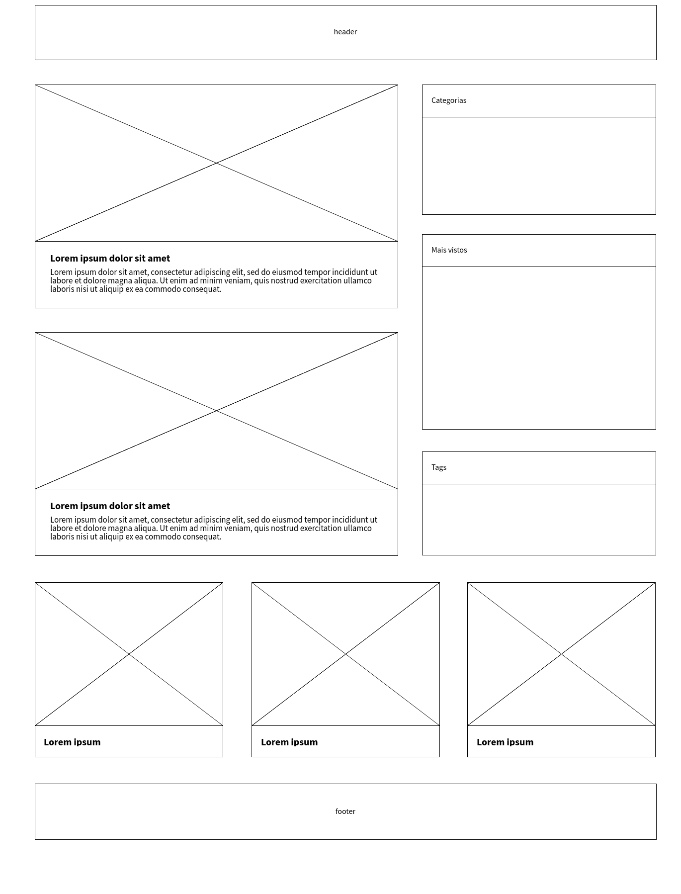

<em>02 - Atividade - Blog Template</em>

<strong>Atividade - Blog Template</strong>

Na atividade de hoje, você vai desenvolver um blog. O tema, assunto, cores e toda a estilização ficam por sua conta. Seja criativo!

Você vai receber um wireframe, um esqueleto com a disposição prevista para os elementos do seu blog, para você usar como base no desenvolvimento do projeto.

<strong>Projeto:</strong>

Você vai receber um repositório já iniciado, com uma estrutura base de projeto. Os arquivos HTML e CSS está apenas iniciados, então você ficou responsável pela estruturação, tanto dos elementos quando do arquivo css. Faça o fork do repositório fornecido, e continue a partir dai.

README.md
index.html
/assets
/css
style.css
/img
blog-template.png

<strong>Você vai utilizar o seguinte layout como base:</strong>

Você também encontra a imagem do template dentro do repositório, dentro da pasta img, com o nome de blog-template.png.

<strong>Repositório</strong>

Faça o fork do repositório, nesse [link](https://gitlab.com/kenzie-academy-brasil/se/fe/sprint-3-css-week/activity-blog-template) para dar início ao projeto.