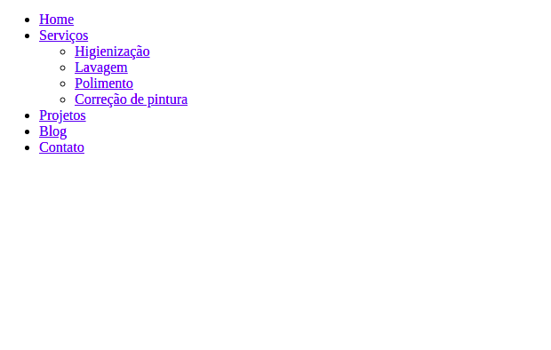
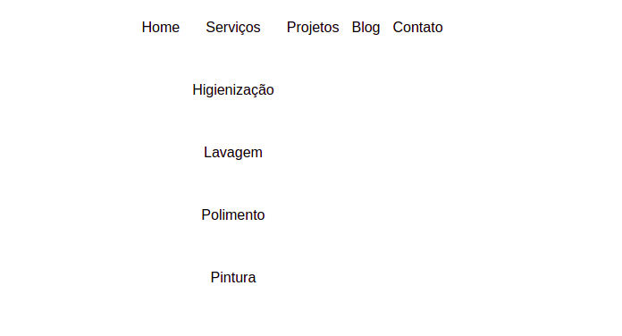
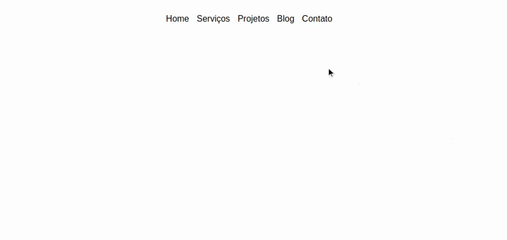

<em>03 - Lista de exercícios - Sprint 3 - CSS Dia 2</em>

<strong>Lista de exercícios - Sprint 3 - CSS Dia 2</strong>

Na lista de exercícios de hoje vamos nos aprofundar um pouco mais, principalmente em dois conceitos: o hover e o position.

<strong>Construindo um menu com submenu</strong>

Vamos aumentar nosso repertório e ver mais uma maneira de aplicar esses conceitos na prática, construindo passo a passo um menu com submenu.

A cada exercício, você vai construir mais um pedacinho do menu e no final da lista, você está preparado para fazer a criação de submenus nos seus futuros projetos.

Vamos la?

<strong>1. O HTML: Criando a estrutura do menu</strong>

O primeiro passo, logicamente, é a estruturação dos elementos HTML do seu menu. Acredito que você já está familiarizado com a estrutura de um menu simples:

<nav>
    <ul class="main-menu">
        <li><a href="#">Home</a></li>
        <li><a href="#">Serviços</a></li>
        <li><a href="#">Projetos</a></li>
        <li><a href="#">Blog</a></li>
        <li><a href="#">Contato</a></li>
    </ul>
</nav>

Mas precisa adaptar esse menu para a sua estrutura ter um outro menu dentro dele, ou seja, um submenu.

Então, la dentro nós vamos adicionar esse menu:

<nav>
    <ul class="main-menu">
        <li><a href="#">Home</a></li>
        <li>
            <a href="#">Serviços</a>
            <nav>
                <ul>
                    <li><a href="#">Higienização</a></li>
                    <li><a href="#">Lavagem</a></li>
                    <li><a href="#">Polimento</a></li>
                    <li><a href="#">Correção de pintura</a></li>
                </ul>
            </nav>
        </li>
        <li><a href="#">Projetos</a></li>
        <li><a href="#">Blog</a></li>
        <li><a href="#">Contato</a></li>
    </ul>
</nav>

Perceba que um novo menu foi adicionado dentro de um dos li's, ou seja, um do itens do menu principal. Sendo esse o "responsável" pelo submenu, é nele que vamos aplicar o hover.

Com esse código teremos o seguinte resultado:

Pronto, criado a estrutura, vamos partir para o próximo passo!

<strong>2. O CSS: Estilização inicial do menu</strong>

Bom, como você deve ter percebido no exemplo acima, o menu não está esteticamente agradavel... ainda.

Primeiro você vai precisar de reset, utilize um de sua preferência. Mas vou deixar uma sugestão aqui também:

html, body, figure, div, input, textarea, p, h1, h2, h3, h4, h5, h6, ul, a{
    margin: 0;
    padding: 0;
    box-sizing: border-box;
    font-family: sans-serif;
    list-style: none;
    text-decoration: none;
}

Vamos agora, deixar ele mais apresentável. Utilize o seguinte código para isso:

header nav .main-menu{
    text-align: center;
    display: flex;
    justify-content: center;
}
header nav .main-menu li a{
    padding: 26px 7px;
    color: #000;
    display: inline-block;
}

Resultado:

Estilização finalizada, por enquanto. Próximo passo: hover!

<strong>3. O hover: funcionamento abre e fecha do submenu</strong>

Bom, o menu já está mais bonito, mas ainda não é bem isso que nós queremos, certo? Vamos fazer com que esse submenu fique escondido e só apareça quando o usuário passar o mouse em cima do li no qual ele está envolvido.

<strong>Nesse momento nós precisamos nos preocupar com uma coisa:</strong>

1. O hover precisa ser apenas em um li, <strong>não em todos</strong>, então, você precisa pensar em como especificar isso. Pode ser com um id ou com uma class, ou então através da pseudo-classe nth-child, que é a que eu vou utilizar aqui. Veja no código abaixo:

Primeiro, vamos esconder o submenu. Aqui vamos utilizar a propriedade display:

header nav .main-menu li nav{
    display: none;
}

Em seguida, vamos adicionar o hover ao li, trocando o valor da propriedade display do submenu:

header nav .main-menu li:nth-child(2):hover nav{
    display: block;
}

Quase lá, pessoal! Vamos partir para a fase final: o position.

<strong>4. O position: ajustando posicionamento</strong>

Você deve ter percebido que quando fazemos o hover, o submenu interfere no restante dos elementos e meio que "empurra" eles para o lado. Isso não é bom.

Para impedir que isso aconteça, vamos aplicar a propriedade position ao submenu, com o valor absolute:

header nav .main-menu li nav {
    display: none;
    position: absolute; /* => nova linha adicionada */
}

Nesse caso não será necessário utilizar o relative, porque não vamos mover o submenu, estamos adicionando o absolute, apenas para que ele não interfira e quebre o restante do site.

Resultado esperado:

E pronto! Assim finalizamos nossa lista de exercícios e também nosso submenu.

Claro que aqui fizemos da maneira mais simples possível, apenas para apresentar para vocês. Mas experimente! Personalize, deixe com a sua carinha, brinque um pouco, sem medo.
