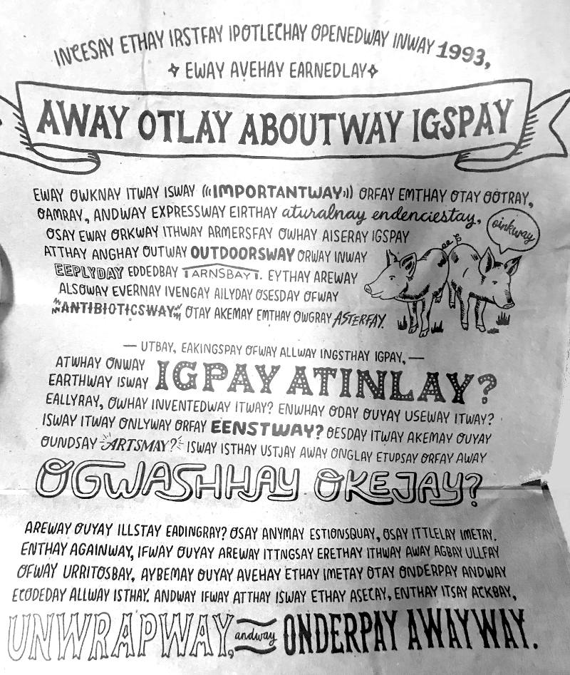

<em>07 - Atividade: Tradutor de Pig Latin</em>

<h1>Atividade: Tradutor de Pig Latin</h1>

Você tem ido ao Chipotle? Eu tenho. A embalagem continha essas maluquices aqui:

<em>**Essa atividade não está sendo patrocinada pela Chipotle, apesar do Chok ser um grande fã.</em>

<strong>Sua missão é escrever um programa especial que descubra o que isso significa!</strong>

<strong>Dica:</strong> A mensagem está escrita em Pig Latin.

<strong>Leia</strong> [Pig Latin](https://simple.wikipedia.org/wiki/Pig_Latin) em inglês.

Como há muitas variações das regras do Pig Latin, por favor, adote estas regras para traduzir as palavras de inglês para pig latin:

<ul>
<li><strong>Palavras começando com som de vogal</strong>, apenas adicione "yay" no final da palavra. Por exemplo, "eat" se torna "eatyay".</li>
<li><strong>Para palavras começando com som de consoante</strong>, todas as letras antes da primeira vogal são colocadas no final da palavra, antecedidas por um hífen "-". Em seguida, adicione "ay". Por exemplo, "latin" se torna "atin-lay".</li>
</ul>

<strong>Como Começar</strong>

Copie o conteúdo deste [repl.it](https://replit.com/@kenzieacademy/Pig-Latin) para um arquivo javascript local, crie uma página HTML em branco que inclua o script e depois siga as instruções para implementar os Passos 1 a 10.

Incluímos algumas funções pré-incorporadas para ajudá-lo a verificar seu progresso à medida que avança no exercício. Por exemplo, depois de implementar o Passo 1, carregue sua página novamente e verifique o console. Se você ver um erro como "english to pig latin failed…", talvez seja necessário consertar algo no código. Se não ver nenhum erro como esse, então está no caminho certo! ood-gay uck-lay!